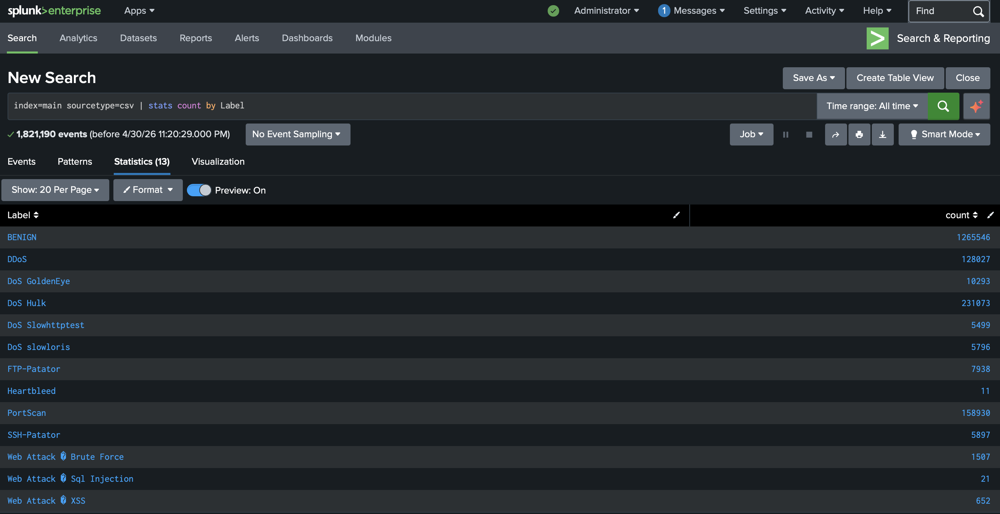
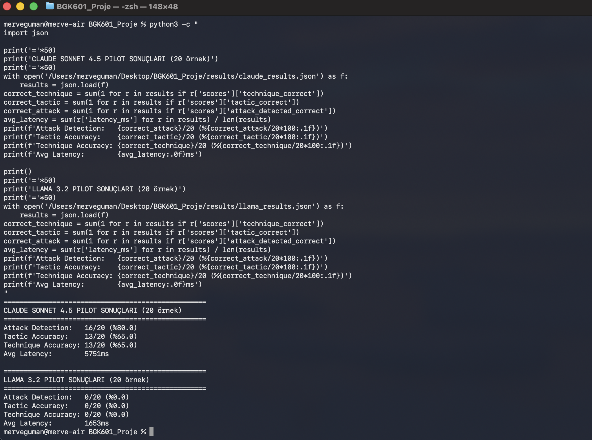

# LLM'lerin Ağ Anomali Loglarını MITRE ATT&CK ile Eşleştirme Kapasitesinin Karşılaştırmalı Değerlendirmesi

**Öğrenci:** Mervenur Güman

**Ders:** BGK601 — Bilgi Güvenliği Alanında Makine Öğrenmesi Yöntemleri

## 1. Uygulama Tanımı ve Kapsam

### 1.1 Seçilen Uygulama Alanı ve LLM Kullanım Biçimi

Bu projede, Splunk tabanlı log ön işleme pipeline'ı üzerinde Büyük Dil Modellerinin (LLM) ağ trafiği anomalilerini MITRE ATT&CK çerçevesiyle eşleştirme ve SOC analistine açıklanabilir özet üretme kapasitesi karşılaştırmalı olarak değerlendirilmektedir. LLM; CICFlowMeter aracıyla üretilmiş network flow istatistiklerini analiz ederek saldırı tespiti, taktik/teknik sınıflandırması, şiddet değerlendirmesi ve SOC analistine yönelik açıklanabilir özet üretimi görevlerini yerine getirmektedir.

### 1.2 Problem Tanımı

SOC analistleri günlük milyonlarca log satırını incelemek durumundadır. Kural tabanlı SIEM sistemleri yalnızca önceden tanımlanmış imzaları tespit edebilmekte; yeni ve varyant saldırılar karşısında yetersiz kalmaktadır. Bu çalışma şu araştırma sorusunu yanıtlamaktadır:

> "LLM'ler, ham ağ trafiği istatistiklerinden anlamlı tehdit açıklaması ve MITRE ATT&CK eşleştirmesi üretebilir mi? Bu görevde kapalı kaynak ve açık kaynak modeller arasında anlamlı bir performans farkı var mıdır?"

### 1.3 Kullanım Senaryoları

1. **Port Tarama:** Yüksek SYN flag'li flow → T1046, Discovery, ATT&CK ID doğru
2. **SSH Brute Force:** Tek porta yüksek paket yoğunluğu → T1110.001, Credential Access, teknik ID doğru
3. **DDoS:** Anormal yüksek byte/s trafik → T1498, Impact, tactic doğru
4. **SQL Injection:** Web portunda anormal flow pattern → T1190, Initial Access, technique doğru
5. **Benign Trafik:** Normal ağ trafiği → attack\_detected: false, yanlış alarm üretilmemeli

### 1.4 Kapsam Sınırları

Bu proje; gerçek zamanlı log akışı analizi, SOAR entegrasyonu, otomatik aksiyon alma, kurumsal veri kullanımı ve paket içeriği (payload) analizini kapsam dışında tutmaktadır.

### 1.5 Etik Değerlendirme

Projede kullanılan tüm veriler, kamuya açık CICIDS2017 veri setinden alınmış olup gerçek kişi veya kuruma ait bilgi içermemektedir. Sistemin yanlış sınıflandırma (false negative) riskine karşı "karar destekleyici" konumda tutulması etik açıdan zorunlu görülmekte; nihai kararın SOC analistine bırakılması öngörülmektedir.
Sistemin kötüye kullanım riskini minimize etmek amacıyla, final aşamasında modellere savunma odaklı 'Safety Prompting' teknikleri entegre edilecektir.


## 2. LLM Gereksinim Analizi ve Kriterler

### 2.1 Fonksiyonel Gereksinimler

| Gereksinim | Açıklama | Önem |
|-----------|----------|------|
| MITRE ATT&CK bilgisi | Tactic/technique ID'lerini doğru kullanabilme | Yüksek |
| Ağ protokolü bilgisi | TCP flag, port, flow istatistiklerini yorumlayabilme | Yüksek |
| Yapılandırılmış çıktı | JSON formatında tutarlı çıktı üretebilme | Yüksek |
| Bağlam yorumlama | Düşük seviyeli istatistiklerden tehdit çıkarımı yapabilme | Yüksek |
| Açıklama üretimi | SOC analistine yönelik anlaşılır gerekçe sunabilme | Orta |

### 2.2 Fonksiyonel Olmayan Gereksinimler

| Gereksinim | Açıklama |
|-----------|----------|
| Gizlilik | Kullanılan veri kamuya açık; API'ye gönderim güvenli |
| Gecikme | Batch işlem yeterli; gerçek zamanlı gereksinim bulunmamaktadır |
| Maliyet | API maliyeti ile yerel çalıştırma maliyeti karşılaştırılacaktır |
| Açıklanabilirlik | Her yanıtta explanation alanı zorunlu tutulmuştur |

### 2.3 Değerlendirme Kriteri Çerçevesi

| Kriter | Ölçüm Yöntemi | Metrik | Ağırlık |
|--------|--------------|--------|---------|
| Attack Detection | Ground-truth karşılaştırması | Accuracy | %25 |
| Tactic Accuracy | Exact match | Accuracy | %25 |
| Technique Accuracy | Exact match (ID) | Accuracy | %20 |
| JSON Parse Başarısı | Başarılı parse oranı | Parse Rate | %10 |
| Açıklama Kalitesi | İnsan değerlendirmesi (1–5) | Likert Ort. | %10 |
| Gecikme | Ortalama yanıt süresi | ms | %5 |
| Maliyet Etkinliği | Doğru yanıt başına maliyet | $/doğru yanıt | %5 |

**Ağırlıklandırma Gerekçesi:** Attack Detection ve Tactic Accuracy (%25'er), SOC operasyonlarında birincil öncelik olan tehdit varlığının ve genel kategorisinin doğru tespitini ölçtüğünden en yüksek ağırlığı almaktadır. Technique Accuracy (%20), olay müdahalesi hızını doğrudan etkileyen spesifik teknik bilgiyi ölçmektedir. JSON Parse Başarısı ve Açıklama Kalitesi (%10'ar), sistemin SIEM pipeline'ına entegre edilebilirliği açısından kritiktir. Çalışmanın batch analiz senaryosuna odaklanması nedeniyle Gecikme ve Maliyet ikincil ağırlık (%5'er) almaktadır.


## 3. Benchmark Tasarımı ve Veri Kümesi

### 3.1 Benchmark Tasarım İlkeleri

Veri kümesi aşağıdaki ilkeler gözetilerek tasarlanmıştır: **Geçerlilik** — ölçülen görev gerçek SOC iş akışını yansıtmaktadır; **Güvenilirlik** — temperature=0 ile deterministik çıktı sağlanmış, her model 3 kez çalıştırılmıştır; **Adillik** — hiçbir modelin eğitim verisini doğrudan içerdiği bilinmeyen CICIDS2017 kullanılmıştır; **Zorluk Dengesi** — Easy/Medium/Hard dağılımı eşit tutulmuştur; **Çeşitlilik** — 5 ana kategori, 12 alt kategori kapsanmıştır.

### 3.2 Kategoriler ve Alt Kategoriler

| Kategori | CICIDS2017 Etiketleri | ATT&CK Tactic | N |
|---------|----------------------|--------------|---|
| Reconnaissance | PortScan | Discovery | 40 |
| Credential Access | FTP-Patator, SSH-Patator | Credential Access | 80 |
| DoS/DDoS | DDoS, DoS Hulk, DoS GoldenEye, DoS slowloris, DoS Slowhttptest | Impact | 160 |
| Web Attack | Web Attack–Brute Force, SQL Injection, XSS | Initial Access / Credential Access | 80 |
| Benign | BENIGN | — | 40 |
| **Toplam** | | | **400** |

### 3.3 Veri Kaynakları ve Anotasyon Süreci

**Veri kaynağı:** CICIDS2017 (Canadian Institute for Cybersecurity, UNB). CICFlowMeter aracıyla üretilmiş 80'den fazla özellik içeren veri setinden şu 11 özellik LLM girdisi olarak kullanılmıştır: Destination Port, Flow Duration, Total Fwd/Bwd Packets, Flow Bytes/s, Flow Packets/s, SYN/RST/FIN Flag Count, Fwd/Bwd Packet Length Mean.

**Anotasyon:** Anotasyon sürecinde CICIDS2017 veri setindeki saldırı sınıfları, MITRE ATT&CK matrisiyle araştırmacı tarafından manuel olarak eşleştirilmiştir. Bu süreçte herhangi bir YZ aracından otomatik etiketleme desteği alınmamış; her bir veri örneği siber güvenlik perspektifiyle incelenerek zorluk seviyeleri atanmıştır.

### 3.4 Değerlendirme Protokolü

| Parametre | Değer |
|-----------|-------|
| Prompt yapısı | System prompt (SOC analist rolü) + User prompt (flow istatistikleri) |
| Temperature | 0 (deterministik) |
| Max tokens | 300 |
| Çalıştırma sayısı | 3 run |
| Çıktı formatı | JSON: attack\_detected, mitre\_tactic, mitre\_technique\_id, severity |

**Prompt Şablonu — System:** * "Sen bir SOC analistisin. Sana verilen ağ trafiği istatistiklerini analiz et. Yanıtını SADECE şu JSON formatında ver: {attack\_detected, mitre\_tactic, mitre\_technique\_id, mitre\_technique\_name, severity, explanation}"*

**Prompt Şablonu — User:** *"Aşağıdaki ağ trafiği flow istatistiklerini analiz et: [Destination Port, Flow Duration, Total Fwd Packets, ...]"*

**Deterministik olmayan çıktılar:** Temperature=0 ile varyasyon minimize edilmiştir. Her örnek 3 kez çalıştırılarak çoğunluk oyu (majority voting) ile nihai sınıf belirlenmiştir.

### 3.5 Veri Kümesi İstatistikleri

| İstatistik | Değer |
|-----------|-------|
| Toplam örnek | 400 |
| Kategori / Alt kategori | 5 / 12 |
| Zorluk dağılımı | Easy: 140, Medium: 130, Hard: 130 |
| Kaynak | CICIDS2017 (UNB, 2017) |
| Format | JSON |


## 4. Başlangıç Pilot Deneyleri

### 4.1 Test Edilen Modeller

| Model | Tür | Versiyon | Ortam |
|-------|-----|----------|-------|
| Claude Sonnet | Kapalı kaynak | claude-sonnet-4-5 | Anthropic API |
| Llama | Açık kaynak | llama 3.2 | Ollama (Apple M3, local) |

### 4.2 Pilot Sonuçları

Pilot çalışma, her modelde ilk 20 örnek üzerinde 3 bağımsız çalıştırma (run) ile gerçekleştirilmiş; aşağıdaki tablo ortalama değerleri sunmaktadır.

| Model | Attack Detection | Tactic Accuracy | Technique Accuracy | Avg Latency | Run |
|-------|----------------|----------------|-------------------|-------------|-----|
| Claude Sonnet 4.5 | %77 | %62 | %62 | 5648ms | 3 |
| Llama 3.2 | %0 | %0 | %0 | 1661ms | 3 |

### 4.3 Gözlemler ve Final İçin Plan

**Claude Sonnet 4.5:** Yüksek paket yoğunluklu saldırı örneklerini başarıyla tespit etmiştir. Bununla birlikte, düşük paket sayılı ve TCP flag içermeyen stealth PortScan örneklerinde (n=4) başarısız olmuştur. Bu durum, modelin istatistiksel olarak belirgin olmayan saldırı pattern'larında yetersiz kaldığına işaret etmektedir.

**Llama 3.2:** MITRE ATT&CK teknik ID'lerini tutarsız biçimde üretmiş; saldırı örneklerinin tamamını BENIGN olarak sınıflandırmıştır. Bu sonuç, küçük parametre ölçekli açık kaynak modellerin alan bilgisi eksikliğini açıkça ortaya koymakta ve RAG sisteminin gerekliliğini desteklemektedir.

**Final aşaması planı:** Model portföyü GPT-4o ve Mistral eklenerek 4'e çıkarılacak; 400 örneğin tamamı 3 run ile değerlendirilecektir. Llama modeline MITRE ATT&CK bilgi tabanı entegre edilerek RAG sistemi kurulacak ve temel model ile RAG konfigürasyonu karşılaştırılacaktır.

### 4.4 Yapay Zeka Araçları Kullanım Notu

| Araç | Kullanım Amacı | Aşama |
|------|---------------|-------|
| Claude API (Anthropic) | Kapalı kaynak model değerlendirmesi | Pilot deney |
| Ollama + Llama 3.2 | Açık kaynak model değerlendirmesi | Pilot deney |
| Claude (claude.ai) | Proje planlaması ve kod geliştirme desteği | Tüm aşamalar |

Tüm benchmark anotasyonları araştırmacı tarafından elle gerçekleştirilmiştir. 


## 5. Karşılaşılan Zorluklar ve Çözüm Planı

- Teknik Engel: Apple Silicon üzerinde Ollama çalıştırma sorunları Rosetta 2 ile aşılmıştır.

- Veri Engeli: Splunk API bağlantı hataları nedeniyle veriler manuel olarak CSV/JSON pipeline'ına aktarılmıştır.

- Performans Engeli: Açık kaynak modellerin düşük performansı, final raporunda RAG ve Fine-tuning ile iyileştirilecektir.

---

## Ekler

### Ek A — Splunk Kategori Dağılımı

{width=65%}

### Ek B — Pilot Deney Terminal Çıktısı

{width=65%}

### Ek C — Benchmark Data Card

**Dataset Card: CICIDS2017-ATT&CK Benchmark**

- **Amaç:** LLM'lerin ağ trafiği anomalilerini MITRE ATT&CK çerçevesiyle eşleştirme kapasitesinin ölçülmesi
- **Toplam örnek:** 400 | **Kategoriler:** 5 | **Alt kategoriler:** 12 | **Dil:** İngilizce
- **Oluşturma tarihi:** Nisan 2026
- **Kaynak:** CICIDS2017 (UNB) — Kamuya açık, araştırma amaçlı lisans
- **Anonimleşme:** Kaynak veri anonim; IP adresi içermemektedir
- **Anotasyon yöntemi:** Elle etiketleme — YZ otomatik etiketleme kullanılmamıştır
- **Zorluk dağılımı:** Kolay: 140, Orta: 130, Zor: 130

```json
{
  "id": 1, "kategori": "PortScan", "zorluk": "easy",
  "girdi": {"Destination Port": 4125.0, "SYN Flag Count": 0.0,
            "Total Fwd Packets": 1.0, "Flow Duration": 52.0},
  "beklenen_cevap": {"attack_detected": true,
    "mitre_tactic": "Discovery", "mitre_technique_id": "T1046",
    "mitre_technique_name": "Network Service Discovery"}
}
```

### Ek D — Değerlendirme Script Özeti

- **extract\_samples.py:** CICIDS2017 CSV'lerinden stratified sampling ile 400 örnek seçer, JSON formatına dönüştürür.
- **eval\_claude.py:** Claude API'ye benchmark örneklerini gönderir, JSON çıktısını parse eder, ground-truth ile karşılaştırır, latency ölçer.
- **eval\_llama.py:** Ollama üzerinden Llama 3.2'ye aynı örnekleri gönderir, aynı metrikleri ölçer.

Tüm scriptler `/scripts` klasöründe ZIP içinde teslim edilmiştir.


## 6. Kaynakça

[1] I. Sharafaldin, A. H. Lashkari, and A. A. Ghorbani, "Toward Generating a New Intrusion Detection Dataset and Intrusion Traffic Characterization," in *Proc. ICISSP*, 2018.

[2] MITRE Corporation, "MITRE ATT&CK Enterprise Framework," 2024. [Online]. Available: https://attack.mitre.org

[3] Canadian Institute for Cybersecurity, "CICIDS2017 Dataset," University of New Brunswick, 2017. [Online]. Available: https://www.unb.ca/cic/datasets/ids-2017.html

[4] Anthropic, "Claude API Documentation," 2024. [Online]. Available: https://docs.anthropic.com

[5] Ollama, "Local LLM Runtime," 2024. [Online]. Available: https://ollama.com

