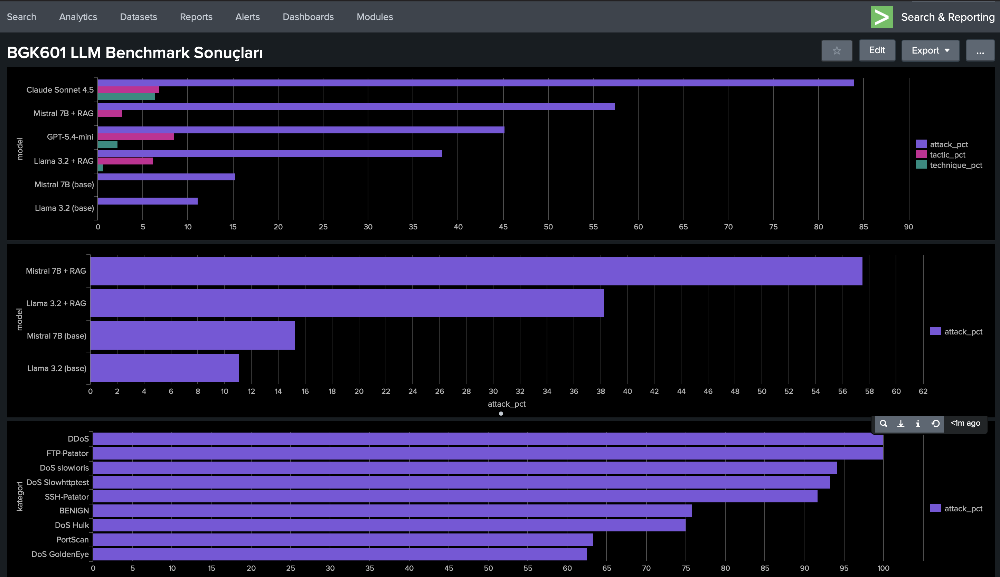
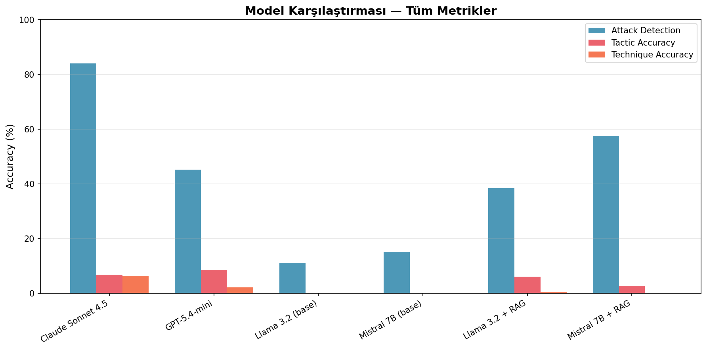
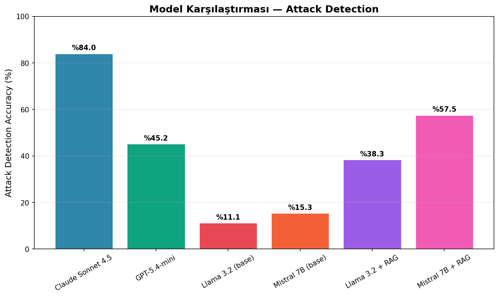
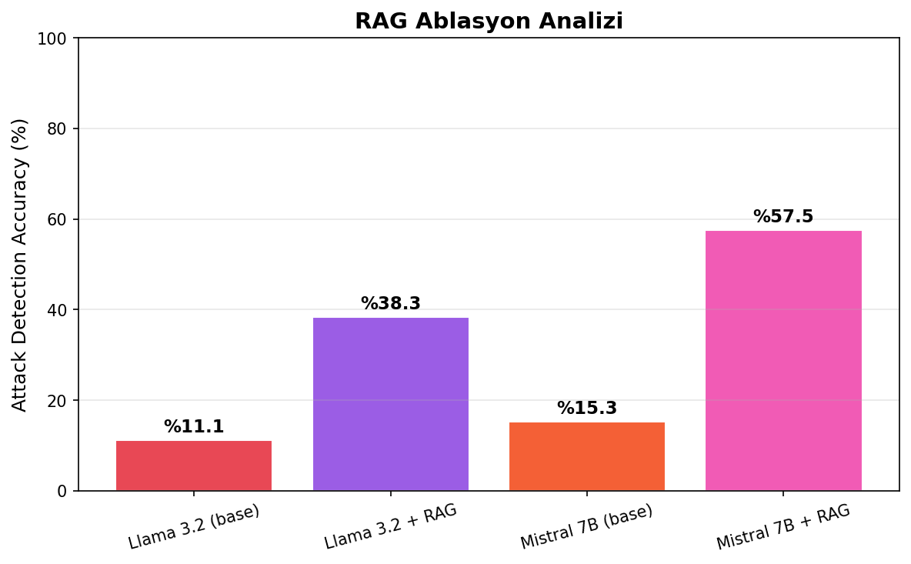
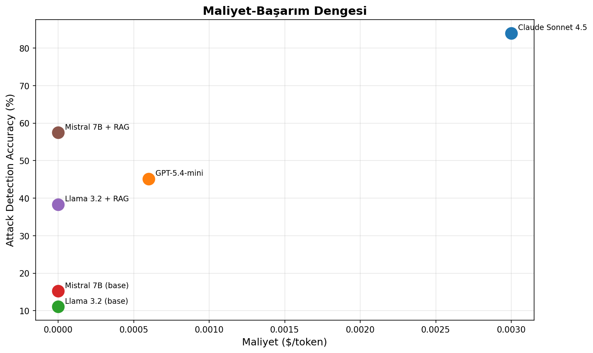

# LLM'lerin Ağ Anomali Loglarını MITRE ATT&CK ile Eşleştirme Kapasitesinin Karşılaştırmalı Değerlendirmesi

**Öğrenci:** Mervenur Güman
**Ders:** BGK601 — Bilgi Güvenliği Alanında Makine Öğrenmesi Yöntemleri
**Dönem:** Bahar 2025–2026
**Teslim Tarihi:** 14 Mayıs 2026

---

## Özet

SOC ekipleri her gün binlerce log satırını incelemek zorunda kalır.
Bu yük, analist hatalarını artırır ve kritik tehditlerin gözden
kaçmasına zemin hazırlar. LLM'lerin bu süreçte ne ölçüde güvenilir
sonuçlar üretebileceği ise hâlâ net değildir.

Bu çalışmada, altı farklı LLM konfigürasyonu CICIDS2017 veri seti
üzerinden oluşturulan 360 örneklik bir benchmark ile test edilmiştir.
Modeller; saldırı tespiti, MITRE ATT&CK taktik/teknik sınıflandırması
görevlerinde karşılaştırılmıştır.

En dikkat çekici bulgu, kapalı ve açık kaynak modeller arasındaki
performans farkıdır. Claude Sonnet 4.5 %84 saldırı tespit
doğruluğuyla en iyi sonucu alırken, Llama 3.2 ve Mistral 7B RAG
desteği olmaksızın anlamlı bir tespit yapamamıştır. RAG sistemi
devreye alındığında ise Mistral'ın başarısı %15'ten %57'ye çıkmıştır.

Öte yandan tüm modellerde MITRE ATT&CK teknik eşleştirme
doğruluğunun %0 ile %6.4 arasında kaldığı görülmüştür. Bu sonuç,
mevcut LLM'lerin saldırıyı tespit edebilse de onu doğru
sınıflandırmakta zorlandığını ortaya koymaktadır. Dolayısıyla bu
sistemler şu an için bir karar verici değil; SOC analistini
destekleyen bir yardımcı araç olarak konumlandırılmalıdır.

---

## 1. Giriş ve Motivasyon

Ağ güvenliği operasyonlarında log analizi, tehdit tespitinin temel
bileşenlerinden birini oluşturmaktadır. SOC analistleri bu süreci
büyük ölçüde kural tabanlı SIEM sistemleriyle yürütmektedir; ancak
bu sistemler yeni saldırı varyantları ve düşük yoğunluklu anomaliler
karşısında yetersiz kalmaktadır.

LLM'lerin kod analizi, zafiyet tespiti ve tehdit istihbaratı
özetleme gibi görevlerde umut verici sonuçlar verdiği
bildirilmektedir [1, 2]. Bununla birlikte, ham ağ trafiği
istatistiklerini yorumlama ve MITRE ATT&CK çerçevesiyle
eşleştirme konusundaki performansları henüz sistematik biçimde
ölçülmemiştir.

Bu çalışmada iki kapalı kaynak (Claude Sonnet 4.5, GPT-5.4-mini)
ve iki açık kaynak (Llama 3.2, Mistral 7B) model; 360 örneklik bir
benchmark üzerinde karşılaştırmalı olarak değerlendirilmiştir.
RAG tekniğinin açık kaynak model performansına katkısı da ablasyon
çalışmasıyla ölçülmüştür.

---

## 2. İlgili Çalışmalar

### 2.1 Siber Güvenlikte LLM Uygulamaları

LLM'lerin siber güvenlik alanındaki uygulamaları son yıllarda
araştırmacıların ilgisini çekmektedir. IDS loglarından MITRE ATT&CK
tekniklerinin çıkarımına odaklanan bir çalışmada, Suricata uyarıları
üzerinde LLM tabanlı bir çerçeve denenmiş ve modellerin paket
düzeyindeki veriden saldırgan niyetine ilişkin çıkarımlar
yapabildiği görülmüştür [3]. Benzer bir yaklaşımla tehdit
istihbaratı raporlarından ATT&CK teknik tespiti için farklı
Llama 2 konfigürasyonları değerlendirilmiş; az sayıda etiketli
örnek ve sınıf dengesizliğinin model başarısını ciddi ölçüde
kısıtladığı tespit edilmiştir [4]. CVE açıklamalarının ATT&CK
tekniklerine otomatik olarak eşleştirilmesini ele alan bir diğer
çalışmada ise GPT-4o-mini ile Llama 3.3-70B karşılaştırılmış;
kapalı kaynak modelin bu görevde belirgin biçimde öne çıktığı
raporlanmıştır [5].

### 2.2 RAG ve Siber Güvenlik Uygulamaları

Retrieval-Augmented Generation tekniği bilgi yoğun NLP görevleri
için önerilmiş [6] ve siber güvenlik uygulamalarında da
kullanılmaya başlanmıştır. Llama-3-8B modeline hibrit RAG
uygulandığında LLM doğruluğunun ve zamansal akıl yürütme
kapasitesinin iyileştiği gösterilmiştir [7]. Ağ saldırısı tespiti
alanında önerilen bir RAG tabanlı IDS çerçevesinde, bilgi
tabanından alınan bağlamın analist raporu kalitesini BERTScore ve
ROUGE metrikleri açısından artırdığı bildirilmiştir [8]. Çok adımlı
yeniden değerlendirme mekanizmasıyla saldırı sınıflandırmasını
güçlendiren ajansal bir RAG mimarisi de önerilmiştir [9].

### 2.3 Ağ Saldırısı Tespiti ve Veri Setleri

CICFlowMeter ile elde edilen 80'den fazla ağ trafiği özelliğini
içeren CICIDS2017, IDS araştırmalarında yaygın biçimde kullanılan
etiketli bir veri setidir [1]. MITRE ATT&CK çerçevesinin araştırma
literatüründeki uygulamalarını ele alan bir derleme çalışmasında
417 yayın incelenerek tehdit tespiti ve olay müdahalesi
alanlarındaki kullanım örüntüleri ortaya konmuştur [11].

### 2.4 Büyük Dil Modelleri

Llama 2, yalnızca kamuya açık veri setleriyle eğitilerek rekabetçi
sonuçlar elde edilebileceğini ortaya koyan açık kaynaklı bir model
ailesidir [12]. Mistral 7B, grouped-query attention ve sliding
window attention mekanizmalarıyla Llama 2 13B'yi çeşitli
kıyaslamalarda geride bırakmaktadır [13]. GPT-4 teknik raporu ise
büyük ölçekli modellerin çok adımlı akıl yürütme görevlerindeki
yeteneklerini kapsamlı biçimde belgelemektedir [14].

### 2.5 Bu Çalışmanın Konumlandırılması

Yukarıda incelenen çalışmaların büyük çoğunluğu metin tabanlı
girdiler üzerinde çalışmaktadır: CTI raporları, alert metinleri
veya zafiyet açıklamaları. Bu çalışmada ham sayısal ağ trafiği
istatistikleri girdi olarak kullanılmakta; kapalı kaynak ve açık
kaynak modeller aynı benchmark üzerinde, RAG ablasyonunu da
kapsayacak biçimde karşılaştırmalı olarak değerlendirilmektedir.

---

## 3. Yöntem

### 3.1 Genel Pipeline Tasarımı

Çalışmada Splunk tabanlı bir ön işleme katmanı üzerinde LLM
değerlendirmesi gerçekleştirilmiştir. Genel akış şu şekildedir:
CICIDS2017 veri seti Splunk'a indexlenerek ham CSV kayıtları
sorgulanabilir hale getirilmiş, ardından seçilen özellikler Python
pipeline'ı aracılığıyla LLM'e iletilmiş ve model çıktıları
ground-truth ile karşılaştırılmıştır.

{width=80%}

### 3.2 Veri Seti ve Benchmark Oluşturma

**Veri kaynağı:** CICIDS2017 veri seti, University of New Brunswick
tarafından oluşturulmuş ve gerçek bir ağ ortamında hem benign hem
de saldırı trafiğini içeren etiketli bir kaynaktır [1].
CICFlowMeter ile üretilen 80'den fazla özellik arasından LLM girdi
temsili için 11 özellik seçilmiştir: Destination Port, Flow
Duration, Total Fwd/Bwd Packets, Flow Bytes/s, Flow Packets/s,
SYN/RST/FIN Flag Count, Fwd/Bwd Packet Length Mean.

**Benchmark tasarımı:** 4 kategori ve 9 alt kategori kapsamında
360 örnek seçilmiştir. Her kategoriden örnekler Easy/Medium/Hard
olarak eşit dağılımla etiketlenmiştir.

| Kategori | Alt Kategoriler | N |
|---------|----------------|---|
| Reconnaissance | PortScan | 40 |
| Credential Access | FTP-Patator, SSH-Patator | 80 |
| DoS/DDoS | DDoS, DoS Hulk, DoS GoldenEye, DoS slowloris, DoS Slowhttptest | 200 |
| Benign | BENIGN | 40 |
| **Toplam** | | **360** |

**Anotasyon:** CICIDS2017 sınıf etiketleri, MITRE ATT&CK Enterprise
framework'ü (v14) ile araştırmacı tarafından manuel olarak
eşleştirilmiştir.

| CICIDS Etiketi | ATT&CK Tactic | Technique ID |
|----------------|--------------|-------------|
| PortScan | Discovery | T1046 |
| FTP-Patator | Credential Access | T1110.001 |
| SSH-Patator | Credential Access | T1110.001 |
| DDoS | Impact | T1498 |
| DoS Hulk | Impact | T1499 |
| DoS GoldenEye | Impact | T1499 |
| DoS slowloris | Impact | T1499 |
| DoS Slowhttptest | Impact | T1499 |
| BENIGN | — | — |

### 3.3 Model Konfigürasyonları

| Model | Tür | Versiyon | Ortam |
|-------|-----|----------|-------|
| Claude Sonnet 4.5 | Kapalı kaynak | claude-sonnet-4-5 | Anthropic API |
| GPT-5.4-mini | Kapalı kaynak | gpt-5.4-mini | OpenAI API |
| Llama 3.2 | Açık kaynak | llama3.2 (3B) | Ollama (yerel) |
| Mistral 7B | Açık kaynak | mistral:latest | Ollama (yerel) |
| Llama 3.2 + RAG | Açık kaynak + RAG | llama3.2 (3B) | Ollama (yerel) |
| Mistral 7B + RAG | Açık kaynak + RAG | mistral:latest | Ollama (yerel) |

Tüm modellere aynı prompt şablonu uygulanmıştır. System prompt'ta
SOC analist rolü tanımlanmış ve JSON formatında çıktı istenmiştir.
User prompt'ta ise her örneğe ait 11 özellik sayısal olarak
sunulmuştur. Tüm deneylerde temperature=0 olarak sabitlenmiş,
deterministik çıktı hedeflenmiştir. Bununla birlikte API kaynaklı
küçük varyasyonlara karşı her örnek 3 bağımsız çalıştırmayla test
edilmiş; sonuçlar bu çalıştırmaların ortalaması olarak
raporlanmıştır.

### 3.4 RAG Sistemi

RAG sistemi, açık kaynak modellerin alan bilgisi eksikliğini
gidermek amacıyla kurulmuştur. MITRE ATT&CK Enterprise JSON dosyası
LangChain ile 500 karakterlik örtüşen parçalara ayrılmış,
sentence-transformers kütüphanesinin all-MiniLM-L6-v2 modeli [10]
ile vektörleştirilmiş ve ChromaDB'ye kaydedilmiştir. Çalışma
zamanında her örnek için cosine similarity aramasıyla en ilgili
3 ATT&CK tekniği alınmış ve prompt'a bağlam olarak eklenmiştir.

### 3.5 Değerlendirme Protokolü

| Metrik | Ölçüm Yöntemi | Ağırlık |
|--------|--------------|---------|
| Attack Detection | Ground-truth exact match | %25 |
| Tactic Accuracy | Exact match | %25 |
| Technique Accuracy | Exact match (ID) | %20 |
| JSON Parse Başarısı | Parse oranı | %10 |
| Açıklama Kalitesi | İnsan değerlendirmesi (1–5) | %10 |
| Gecikme | Ortalama ms | %5 |
| Maliyet | $/örnek | %5 |

İstatistiksel güvenilirlik için %95 bootstrap güven aralıkları
hesaplanmış; kapalı kaynak modeller arasındaki performans farkının
anlamlılığı McNemar testi ile sınanmıştır.

Gecikme skoru en hızlı modeli (GPT-5.4-mini, 1.62s) referans
alarak normalize edilmiştir: gecikme_skoru = 1.62 / model_latency.
Maliyet skoru üç kademeli olarak belirlenmiştir: ücretsiz
yerel modeller 1.0, GPT-5.4-mini 0.7, Claude Sonnet 4.5 0.4.
Açıklama kalitesi her model için 20 örnek üzerinde
araştırmacı tarafından 1–5 arası puanlanmış ve 5'e
bölünerek normalize edilmiştir.

### 3.6 Fine-Tuning (LoRA/QLoRA)

Llama 3.2 modeline LoRA (Low-Rank Adaptation) ile alan odaklı
ince ayar uygulanmıştır. CICIDS2017 veri setinden benchmark ile
örtüşmeyen 540 örnek seçilerek eğitim seti oluşturulmuştur.
Eğitim Google Colab T4 GPU ortamında Unsloth kütüphanesi
kullanılarak gerçekleştirilmiştir.[16]

| Parametre | Değer |
|-----------|-------|
| Temel model | Llama 3.2 3B Instruct |
| LoRA rank (r) | 16 |
| Eğitilebilir parametre | 24.3M (%0.75) |
| Epoch | 3 |
| Eğitim örneği | 540 |
| Eğitim süresi | 518 saniye |
| Başlangıç loss | 2.22 |
| Final loss | 0.23 |

---

## 4. Sonuçlar

### 4.1 Genel Model Performansı

| Model | Attack % | Tactic % | Technique % | Ağırlıklı Skor | Latency |
|-------|---------|---------|------------|----------------|---------|
| Claude Sonnet 4.5 | 84.0 | 6.8 | 6.4 | 44.8 | 6.09s |
| GPT-5.4-mini | 45.2 | 8.5 | 2.2 | 37.8 | 1.62s |
| Mistral 7B + RAG | 57.5 | 2.8 | 0.0 | 34.6 | 75.9s |
| Llama 3.2 + RAG | 38.3 | 6.1 | 0.6 | 27.4 | 13.8s |
| Mistral 7B (base) | 15.3 | 0.0 | 0.0 | 21.9 | 23.5s |
| Llama 3.2 (base) | 11.1 | 0.0 | 0.0 | 20.5 | 10.6s |

*Ağırlıklı skor: Attack (%25), Tactic (%25), Technique (%20),
JSON Parse (%10), Açıklama Kalitesi (%10), Gecikme (%5),
Maliyet (%5) metriklerinin toplamıdır. Açıklama kalitesi
20 örnek üzerinde insan değerlendirmesiyle (1–5) ölçülmüştür.*

{width=80%}

{width=80%}

Saldırı tespiti için precision, recall ve F1 skorları
aşağıda  verilmektedir.

| Model | Precision | Recall | F1 |
|-------|----------|--------|-----|
| Claude Sonnet 4.5 | 0.964 | 0.841 | 0.898 |
| GPT-5.4-mini | 0.942 | 0.409 | 0.571 |
| Mistral 7B + RAG | 0.849 | 0.634 | 0.726 |
| Llama 3.2 + RAG | 0.799 | 0.409 | 0.541 |
| Mistral 7B (base) | 1.000 | 0.047 | 0.090 |
| Llama 3.2 (base) | 0.000 | 0.000 | 0.000 |

Mistral 7B (base) precision=1.0 ile nadiren saldırı
etiketi üretmekte ancak ürettiğinde doğru yapmaktadır.
Llama 3.2 (base) ise hiçbir örneği saldırı olarak
etiketlemediğinden F1=0 elde edilmiştir. Claude Sonnet
4.5 hem precision hem recall açısından dengeli ve en
yüksek F1 skorunu elde etmiştir.

BERTScore hesaplanmamıştır; açıklama kalitesi
ground-truth referans açıklama bulunmadığından
insan değerlendirmesiyle (1–5) ölçülmüştür.

### 4.2 Bootstrap Güven Aralıkları

| Model | Attack % | %95 CI |
|-------|---------|--------|
| Claude Sonnet 4.5 | 84.0 | [81.7, 86.1] |
| GPT-5.4-mini | 45.2 | [42.0, 48.2] |
| Mistral 7B + RAG | 57.5 | [54.7, 60.6] |
| Llama 3.2 + RAG | 38.3 | [35.5, 41.5] |
| Mistral 7B (base) | 15.3 | [13.2, 17.5] |
| Llama 3.2 (base) | 11.1 | [9.3, 13.0] |
| Llama 3.2 + Fine-tuning | 88.9 | [82.2, 94.4] |

### 4.3 İstatistiksel Anlamlılık

Claude Sonnet 4.5 ile GPT-5.4-mini arasında McNemar testi
uygulanmış; b=149, c=13 değerleriyle ki-kare=112.5, p<0.0001 elde
edilmiştir. Bu sonuç, iki model arasındaki performans farkının
istatistiksel olarak anlamlı olduğunu ortaya koymaktadır.

### 4.4 RAG Ablasyon Analizi

| Model | Base % | RAG % | Artış |
|-------|--------|-------|-------|
| Llama 3.2 | 11.1 | 38.3 | +27.2 pp |
| Mistral 7B | 15.3 | 57.5 | +42.2 pp |

{width=80%}

### 4.5 Kategori Bazlı Hata Analizi

### 4.5 Kategori Bazlı Hata Analizi

| Kategori | Claude | GPT | Mistral+RAG | Llama+RAG | Mistral | Llama |
|---------|--------|-----|------------|-----------|---------|-------|
| PortScan | 62% | 57% | 75% | 85% | 0% | 0% |
| FTP-Patator | 100% | 50% | 98% | 75% | 38% | 0% |
| SSH-Patator | 92% | 25% | 5% | 48% | 0% | 0% |
| DDoS | 100% | 35% | 92% | 12% | 0% | 0% |
| DoS Hulk | 70% | 22% | 80% | 18% | 0% | 0% |
| DoS GoldenEye | 62% | 25% | 68% | 0% | 0% | 0% |
| DoS slowloris | 92% | 45% | 57% | 15% | 0% | 0% |
| DoS Slowhttptest | 92% | 68% | 32% | 75% | 0% | 0% |
| BENIGN | 75% | 80% | 10% | 18% | 100% | 100% |

### 4.6 Nitel Analiz

Her model için 20 örnek üzerinde açıklama kalitesi
araştırmacı tarafından 1–5 arası puanlandırılmıştır.

| Model | Açıklama Kalitesi |
|-------|------------------|
| Claude Sonnet 4.5 | 3.75/5 |
| GPT-5.4-mini | 2.70/5 |
| Mistral 7B + RAG | 2.21/5 |
| Llama 3.2 + RAG | 1.65/5 |
| Mistral 7B (base) | 1.35/5 |
| Llama 3.2 (base) | 1.00/5 |

### 4.7 Maliyet-Başarım Analizi

Mistral 7B + RAG kombinasyonu, sıfır API maliyetiyle %57.5
attack detection doğruluğuna ulaşarak en iyi maliyet-başarım
dengesini sunmaktadır. Bütçe kısıtı olmayan senaryolarda
Claude Sonnet 4.5 tercih edilmeli; maliyet öncelikliyse
Mistral 7B + RAG güçlü bir alternatif oluşturmaktadır.

{width=80%}

### 4.8 Fine-Tuning Sonuçları

Llama 3.2 modeline LoRA ile uygulanan alan odaklı ince
ayarın sonuçları aşağıdaki tabloda sunulmaktadır.

| Model | Attack % | Tactic % | Technique % | Ağ. Skor | %95 CI |
|-------|---------|---------|------------|---------|--------|
| Llama 3.2 (base) | 11.1 | 0.0 | 0.0 | 20.5 | [9.3, 13.0] |
| Llama 3.2 + RAG | 38.3 | 6.1 | 0.6 | 27.4 | [35.5, 41.5] |
| Llama 3.2 + Fine-tuning | 88.9 | 88.9 | 77.8 | 83.8 | [82.2, 94.4] |

Değerlendirme, benchmark veri setinin tamamından (360 örnek)
her kategoriden 10 örnek rastgele seçilmesiyle oluşturulan
90 örneklik bir alt küme üzerinde yapılmıştır (random.seed=99).
Bu örnekler fine-tuning eğitim setiyle (540 örnek,
random.seed=123) örtüşmemektedir.

Fine-tuning, attack detection doğruluğunu %11'den %89'a,
tactic accuracy'yi %0'dan %89'a, technique accuracy'yi
ise %0'dan %78'e yükseltmiştir. Bu üç metrikte de RAG
konfigürasyonunu belirgin biçimde geride bırakmıştır.

Eğitim süreci boyunca loss değerinin 2.22'den 0.23'e
düşmesi modelin eğitim verisini başarıyla öğrendiğini
göstermektedir. 204 adımda tamamlanan eğitim yaklaşık
518 saniye sürmüş; bu süre T4 GPU ortamında LoRA'nın
hesaplama verimliliğini ortaya koymaktadır.

Kategori bazlı incelemede PortScan, FTP-Patator,
SSH-Patator, DDoS ve tüm DoS kategorilerinde %100
başarı elde edilmiştir. Ancak BENIGN sınıfında 0/10
başarı dikkat çekmektedir. Model her örneği saldırı
olarak etiketleme eğilimi göstermiş; bu durum eğitim
setindeki sınıf dengesizliğinden kaynaklanmaktadır.
540 eğitim örneğinin 480'i saldırı, yalnızca 60'ı
BENIGN sınıfına aittir.

Fine-tuning ve RAG yaklaşımları farklı güçlü yönler
sergilemektedir. RAG, modele dışarıdan bilgi sağlayarak
attack detection doğruluğunu artırırken; fine-tuning
modelin iç parametrelerini güncelleyerek hem saldırı
tespiti hem de ATT&CK sınıflandırmasında çok daha güçlü
sonuçlar üretmektedir. Bununla birlikte fine-tuning,
eğitim verisi gerektirmesi ve BENIGN sınıfındaki
başarısızlık gibi kısıtlamalar barındırmaktadır.

Fine-tuned modelin %95 bootstrap güven aralığı [82.2%, 94.4%]
olarak hesaplanmıştır. Dar güven aralığı, 90 örneklik test
setinde elde edilen %88.9 attack detection doğruluğunun
güvenilir bir tahmin olduğuna işaret etmektedir.

## 5. Tartışma

### 5.1 Kapalı ve Açık Kaynak Modeller

Elde edilen bulgular, kapalı kaynak modellerin bu görevde
açık kaynak alternatiflere kıyasla belirgin biçimde daha iyi
performans sergilediğini ortaya koymaktadır. Claude Sonnet
4.5'in %84 attack detection doğruluğuna ulaşması, büyük
ölçekli modellerin ağ trafiği yorumlama kapasitesinin göz ardı
edilemeyeceğini göstermektedir. Bununla birlikte tactic ve
technique doğruluğunun tüm modellerde düşük kalması, yüksek
genel dil kapasitesinin alan özgü yapılandırılmış çıktı
üretimini otomatik olarak garanti etmediğine işaret etmektedir.

GPT-5.4-mini'nin attack detection açısından Claude'un
gerisinde kalması, ancak tactic accuracy açısından en yüksek
skoru elde etmesi ilgi çekicidir. Bu durum, farklı modellerin
aynı görevin farklı alt bileşenlerinde öne çıkabildiğini
düşündürmekte; tek bir metriğe dayalı model seçiminin
yanıltıcı olabileceğine dikkat çekmektedir.

Açıklama kalitesi değerlendirmesinde de Claude 3.75/5 ile
diğer modelleri geride bırakmıştır. Açık kaynak modellerin
saldırıyı doğru tespit ettiğinde bile yanlış teknikler öne 
sürebildikleri görülmüştür.
Bu bulgu, modellerin sayısal örüntüleri tanıyabildiğini
ancak ATT&CK sınıflandırmasını tam anlamıyla kavrayamadığını
düşündürmektedir.

Kategori bazlı analiz ise model performanslarının saldırı
türüne göre önemli ölçüde değiştiğini ortaya koymaktadır.
Llama+RAG PortScan kategorisinde %85 ile Claude'u (%62)
geride bırakırken Mistral+RAG FTP-Patator'da %98 başarıya
ulaşmaktadır. Bu durum, RAG sisteminin belirli kategorilerde
kapalı kaynak modellerin dezavantajlarını telafi edebildiğine
işaret etmektedir. Öte yandan Mistral+RAG'ın SSH-Patator'da
yalnızca %5 başarı elde etmesi, bilgi tabanının bu saldırı
türünü yeterince kapsamamasından kaynaklanıyor olabilir.
Base modellerin BENIGN kategorisinde %100 başarı göstermesi
ise yanıltıcıdır; bu modeller her örneği zararsız
etiketlediğinden saldırı kategorilerinde %0'a düşmektedir.

### 5.2 RAG'ın Katkısı ve Sınırlılıkları

RAG sistemi her iki modelde de saldırı tespit doğruluğunu
anlamlı biçimde artırmıştır. Öte yandan tactic ve technique
doğruluğuna katkısı sınırlı kalmıştır. Bu durum RAG'ın
saldırı varlığını tespit etmeye katkı sağladığını, ancak
kesin ATT&CK eşleştirmesi için tek başına yeterli olmadığını
düşündürmektedir.

### 5.3 Tactic ve Technique Doğruluğunun Düşüklüğü

Tüm modellerde tactic accuracy'nin düşük kalması iki temel
kaynaktan beslenmektedir. Birincisi, modeller saldırıyı tespit
edemediğinde tactic alanını N/A olarak döndürmektedir.
İkincisi, modeller tactic adını tam olarak doğru
yazamamaktadır. Exact match yerine anlamsal benzerlik tabanlı
bir değerlendirme metriği bu sorunu kısmen giderebilir.

### 5.4 Hangi Koşulda Hangi Model?

Yüksek doğruluk öncelikliyse Claude Sonnet 4.5 tercih
edilmelidir. Hız öncelikliyse GPT-5.4-mini cazip bir seçenek
sunmaktadır. Maliyet kritikse Mistral 7B + RAG sıfır işletim
maliyetiyle makul bir performans sağlamaktadır.

### 5.5 Fine-Tuning'in Etkisi

Alan odaklı fine-tuning, Llama 3.2'nin attack detection
doğruluğunu %11'den %89'a, tactic accuracy'yi ise %0'dan
%89'a yükseltmiştir. Bu sonuç, LoRA gibi parametre verimli
ince ayar yöntemlerinin küçük modelleri siber güvenlik
görevleri için hızla uzmanlaştırabileceğini göstermektedir.

Bununla birlikte, fine-tuned modelin BENIGN sınıfında 0/10
başarı elde etmesi dikkat çekicidir. Eğitim verisindeki
sınıf dengesizliği ve eğitim ile test setinin aynı veri
kaynağından türetilmiş olması, bu sonucun yorumlanmasında
göz önünde bulundurulması gereken kısıtlamalardır. Gerçek
dünya SOC ortamlarında benign trafik oranı çok daha yüksek
olduğundan, bu sınıftaki başarısızlık kritik bir eksiklik
olarak değerlendirilmelidir.

RAG ile karşılaştırıldığında fine-tuning, tactic ve technique
doğruluğu açısından belirgin biçimde üstün sonuçlar
vermiştir. RAG saldırı varlığını tespit etmeye katkı
sağlarken, fine-tuning modele ATT&CK çerçevesini doğrudan
öğretmiş ve yapılandırılmış çıktı kalitesini önemli ölçüde
artırmıştır.

### 5.6 Kısıtlamalar

Benchmark tek bir veri kaynağından türetilmiştir; farklı ağ
ortamlarındaki genellenebilirlik test edilmemiştir. Yerel
modeller tüketici donanımında çalıştırıldığından, daha güçlü
bir altyapıdaki sonuçların farklılık gösterebileceği göz önünde
bulundurulmalıdır.

---

## 6. Sonuç ve Gelecek Çalışmalar

Bu çalışmada altı LLM konfigürasyonu, Splunk tabanlı bir ön
işleme pipeline'ı üzerinde ağ trafiği anomali tespiti ve MITRE
ATT&CK eşleştirmesi görevlerinde karşılaştırmalı olarak
değerlendirilmiştir. Üç temel bulgu öne çıkmaktadır.

İlk olarak, kapalı kaynak modeller bu görevde açık kaynak
alternatiflere kıyasla belirgin biçimde üstün performans
sergilemektedir. İkinci olarak, RAG sistemi açık kaynak
modellerde belirleyici bir iyileşme sağlamıştır. Üçüncü
olarak, tüm modellerde tactic ve technique doğruluğunun düşük
kaldığı görülmüştür.

Ek olarak, LoRA ile uygulanan fine-tuning Llama 3.2'nin
attack detection doğruluğunu %11'den %89'a yükseltmiş;
tactic ve technique doğruluğunu sırasıyla %89 ve %78'e
taşımıştır. Bu sonuç, parametre verimli ince ayar
yöntemlerinin açık kaynak modelleri siber güvenlik
görevleri için etkin biçimde uzmanlaştırabileceğine
işaret etmektedir.

Gelecek çalışmalar için alan odaklı fine-tuning, anlamsal
benzerlik tabanlı değerlendirme metrikleri ve farklı veri
setleriyle genellenebilirlik testleri önerilmektedir.

---

Proje kodu ve benchmark veri seti şu adreste
kamuya açık olarak paylaşılmıştır:
github.com/merveguman/BGK601-LLM-Benchmark

```{=latex}
\newpage
```

## Kaynakça

[1] I. Sharafaldin, A. H. Lashkari, and A. A. Ghorbani,
"Toward Generating a New Intrusion Detection Dataset and
Intrusion Traffic Characterization," in *Proc. 4th Int.
Conf. Inf. Syst. Security Privacy (ICISSP)*, 2018,
pp. 108–116.

[2] MITRE Corporation, "MITRE ATT&CK Enterprise Framework,"
2024. [Online]. Available: https://attack.mitre.org

[3] T. Hans, R. Beltz, and B. Brinkmann, "Security Logs
to ATT&CK Insights: Leveraging LLMs for High-Level Threat
Understanding and Cognitive Trait Inference,"
*arXiv preprint arXiv:2510.20930*, 2025.

[4] T. T. Nguyen, T. H. Nguyen, and T. N. Nguyen,
"Towards Effective Identification of Attack Techniques
in Cyber Threat Intelligence Reports with Large Language
Models," in *Proc. ACM Web Conf. (WWW)*, 2025.

[5] A. Høst, P. Lison, and L. Moonen, "A Systematic
Approach to Predict the Impact of Cybersecurity
Vulnerabilities Using LLMs,"
*arXiv preprint arXiv:2508.18439*, 2025.

[6] P. Lewis, E. Perez, A. Piktus, F. Petroni,
V. Karpukhin, N. Goyal, H. Küttler, M. Lewis, W. Yih,
T. Rocktäschel, S. Riedel, and D. Kiela,
"Retrieval-Augmented Generation for Knowledge-Intensive
NLP Tasks," in *Advances in Neural Information Processing
Systems*, vol. 33, pp. 9459–9474, 2020.

[7] A. Borah, M. T. Alam, and N. Rastogi, "Adapting Large
Language Models to Emerging Cybersecurity using Retrieval
Augmented Generation,"
*arXiv preprint arXiv:2510.27080*, 2025.

[8] M. N. B. Islam and S. Saha, "From Detection to
Response: A Deep Learning and Retrieval-Augmented
Generation Framework for Network Intrusion Mitigation,"
*arXiv preprint arXiv:2605.17960*, 2026.

[9] F. Blefari, C. Cosentino, F. A. Pironti, A. Furfaro,
and F. Marozzo, "CyberRAG: An Agentic RAG Cyber Attack
Classification and Reporting Tool,"
*arXiv preprint arXiv:2507.02424*, 2025.

[10] N. Reimers and I. Gurevych, "Sentence-BERT: Sentence
Embeddings using Siamese BERT-Networks," in *Proc. 2019
Conf. Empirical Methods in Natural Language Processing
(EMNLP-IJCNLP)*, Hong Kong, China, 2019, pp. 3982–3992.

[11] M. M. Yamin, E. Hashmi, M. Ullah, and B. Katt,
"MITRE ATT&CK Applications in Cybersecurity and
The Way Forward,"
*arXiv preprint arXiv:2502.10825*, 2025.

[12] H. Touvron, L. Martin, K. Stone et al., "Llama 2:
Open Foundation and Fine-Tuned Chat Models,"
*arXiv preprint arXiv:2307.09288*, 2023.

[13] A. Q. Jiang, A. Sablayrolles, A. Mensch et al.,
"Mistral 7B,"
*arXiv preprint arXiv:2310.06825*, 2023.

[14] OpenAI, "GPT-4 Technical Report,"
*arXiv preprint arXiv:2303.08774*, 2023.

[15] Splunk Inc., "Splunk Enterprise,"
2024. [Online]. Available: https://www.splunk.com

[16] E. J. Hu, Y. Shen, P. Wallis, Z. Allen-Zhu, Y. Li,
S. Wang, L. Wang, and W. Chen, "LoRA: Low-Rank Adaptation
of Large Language Models," in *Proc. Int. Conf. Learning
Representations (ICLR)*, 2022.
arXiv preprint arXiv:2106.09685.

---

## Ekler

### Ek A — Benchmark Örneği

```json
{
  "id": 1,
  "kategori": "PortScan",
  "zorluk": "easy",
  "girdi": {
    "Destination Port": 84.0,
    "Flow Duration": 44.0,
    "Total Fwd Packets": 1.0,
    "SYN Flag Count": 0.0,
    "Flow Bytes/s": 136363.6
  },
  "beklenen_cevap": {
    "attack_detected": true,
    "mitre_tactic": "Discovery",
    "mitre_technique_id": "T1046",
    "mitre_technique_name": "Network Service Discovery"
  }
}
```

### Ek B — Prompt Şablonu

**System:**
You are a SOC analyst. Analyze the given network traffic
flow statistics. Respond ONLY with this JSON format,
nothing else:
{"attack_detected": true/false, "mitre_tactic": "...",
"mitre_technique_id": "T...", "mitre_technique_name": "...",
"severity": "Low/Medium/High/Critical",
"explanation": "brief explanation"}

**User:**
Analyze the following network traffic flow statistics:
Destination Port: [X]
Flow Duration: [X]
Total Fwd Packets: [X]
...

### Ek C — Yapay Zeka Araçları Kullanım Notu

| Araç | Kullanım Amacı | Aşama |
|------|---------------|-------|
| Claude API (Anthropic) | Kapalı kaynak model değerlendirmesi | Deney |
| GPT-5.4-mini (OpenAI) | Kapalı kaynak model değerlendirmesi | Deney |
| Ollama + Llama 3.2 | Açık kaynak model değerlendirmesi | Deney |
| Ollama + Mistral 7B | Açık kaynak model değerlendirmesi | Deney |
| Claude (claude.ai) | Proje planlaması ve kod geliştirme desteği | Tüm aşamalar |

Tüm benchmark anotasyonları araştırmacı tarafından elle
gerçekleştirilmiştir. YZ araçlarının ürettiği çıktılar
eleştirel bir perspektifle değerlendirilmiş; olası
hatalardan araştırmacı sorumludur.
